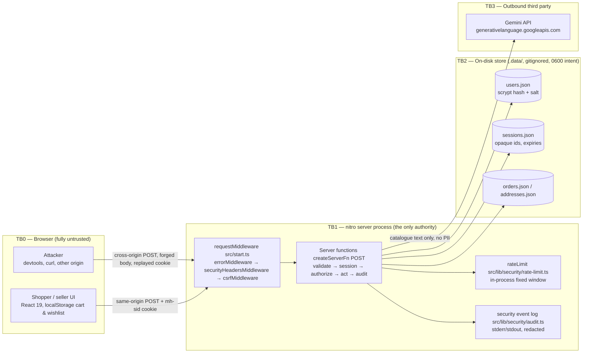

# Design — MarketHub security hardening (Security branch)

**Task:** `security-hardening-2026-10-06`
**Branch:** `Security` (verified `git rev-parse --abbrev-ref HEAD` → `Security` before any read or write)
**Scope:** turn MarketHub from a browser-only demo into a server-authoritative application, and replace `SECURITY_ARCHITECTURE.md` with a document that describes the real system.
**Status of this document:** design only. No source file was modified in this step.

---

## 0. Overview

MarketHub today is a TanStack Start (React 19) storefront whose entire notion of identity lives in `localStorage`. `src/lib/store.tsx` holds `user`, `addresses`, `cart`, `wishlist`, `orders` and `readNotices` under the single key `markethub-state-v1`; `login` is `setUser`, so signing in is a client-side state write with no password check at all (`fakeAuth()` in `src/components/auth/AuthPanel.tsx` is a 1300 ms `setTimeout`). The role gate in `src/components/mh/RequireAuth.tsx` reads that same object, and `RolePicker` in `AuthPanel.tsx` lets the visitor *choose* `customer` or `vendor` before "signing in" — a one-click privilege escalation that needs no devtools. Checkout in `src/routes/checkout.tsx` computes `total` in the browser from `useCartTotals()` and writes the finished `Order` straight into client state.

Exactly one piece of the app is already server-authoritative and well built: `askHubby` in `src/lib/hubby/ask.ts`. It is a `createServerFn({ method: "POST" })` with a hand-rolled `validateAsk` validator, a per-client fixed-window rate limiter, an untrusted-output revalidation step (`validateProductIds` re-resolves every model-returned ID against the real catalogue), and a secret-handling pattern where `GEMINI_API_KEY` is only ever touched inside the handler behind a dynamic `import("./gemini")` so it cannot reach the browser bundle. `src/start.ts` already re-registers `createCsrfMiddleware` (needed because defining `src/start.ts` opts out of Start's automatic installation).

**The design direction is therefore: generalise what `ask.ts` already proves, and move identity, authorization, pricing and order state behind the same boundary.** The nitro server becomes the only authority. The browser keeps cart/wishlist/UI state, because that is genuinely user-local, but it stops being the source of truth for who you are, what role you have, what an item costs, and what you have ordered.

The stack is locked by this design to what is already installed: **TanStack Start 1.168 + TanStack Router 1.170, React 19, Vite 8, nitro 3 (beta), TypeScript 5.9, vitest 4 + jsdom**. Persistence is **file-backed JSON under `.data/` with atomic writes**. Crypto is **`node:crypto` scrypt** only. Validation is a **hand-rolled strict-allow-list validator module** (§4). The only dependency added is zero — we add no runtime dependency at all. Reasons in the sections below.

### 0.1 Design principles (carried over from the existing document, adapted)

These survive the rewrite because they are stack-independent and still correct:

1. **Deny by default.** A server function that does not explicitly resolve a session and assert a permission must not read or write user data.
2. **The server is the only authority.** Role, prices, totals, stock, ownership and order state come from the server store, never from the request body.
3. **Defence in depth where it is cheap.** Session cookie flags *and* server-side session records *and* CSRF origin checking; validation *and* allow-listed field mapping.
4. **Untrusted data stays data.** Browser input, and Gemini output, are never treated as instructions or markup. React's default escaping is the XSS control; `dangerouslySetInnerHTML` stays out of app code.
5. **Fail closed, fail quietly to the client, fail loudly to the log.** Generic client errors, rich server-side security events.
6. **Evidence over claims.** Every control in the conformance matrix names the test that proves it.
7. **Honest scope.** Single-process, file-backed, simulated payment. Documented as such, not dressed up.

### 0.2 What this design deliberately does not do

- No database, ORM, Redis, Docker, or reverse proxy. None are installed and a 24-hour build should not acquire them.
- No MFA/TOTP, no hash-chained audit log, no admin console (there is no `/admin` route; `AuthPanel.tsx` correctly omits the admin option today), no file upload (there is no upload surface), no SQL (there is no SQL).
- No real payment. Checkout stays simulated; card/UPI fields keep never leaving the browser.

---

## 1. Trust boundaries in the real system

```
Browser (untrusted)                     nitro server process (the only authority)                  Disk
┌───────────────────────┐   HTTPS/HTTP  ┌───────────────────────────────────────────┐   fs        ┌──────────┐
│ React 19 SPA/SSR app  │ ────────────► │ requestMiddleware (src/start.ts)          │ ──────────► │ .data/   │
│ localStorage:         │  POST /_serverFn │  error → securityHeaders → csrf        │             │ users    │
│  cart, wishlist, UI   │ ◄──────────── │ server functions (createServerFn POST)    │ ◄────────── │ sessions │
│  mh-sid cookie (opaque,│  Set-Cookie  │  validate → session → authorize → act     │             │ orders   │
│  HttpOnly: unreadable)│               │  rate limit, security event log           │             │ addresses│
└───────────────────────┘               └───────────────────┬───────────────────────┘             └──────────┘
                                                            │ outbound HTTPS (egress boundary)
                                                            ▼
                                                   generativelanguage.googleapis.com
                                                   (Gemini; key never leaves the server)
```

Mermaid version, for `SECURITY_ARCHITECTURE.md`:



| Boundary | What crosses it | Primary controls | File |
|---|---|---|---|
| Browser → server | Every server-function argument, the `mh-sid` cookie, headers | CSRF origin check, strict allow-list validation, rate limiting, session resolution, authorization | `src/start.ts`, `src/lib/security/*` |
| Server → browser | Session cookie, DTOs | `HttpOnly; SameSite=Strict; Secure` (prod); explicit field-by-field DTO mapping, never raw records | `src/lib/auth/session.ts`, each server fn |
| Server → disk | User records, sessions, orders, addresses | Atomic temp-file+rename writes, path never built from user input, `.data/` gitignored | `src/lib/server/store.ts` |
| Server → Gemini | Shopper question + public catalogue snapshot | No PII in prompt (`src/lib/hubby/catalog.ts` already excludes seller contacts), key server-only, output re-validated | `src/lib/hubby/*` (unchanged) |
| Server → logs | Security events | Redaction allow-list; never passwords, session ids, cookies, API keys | `src/lib/security/audit.ts` |

### 1.1 Boundary gaps that are real and must be documented, not hidden

- **Static assets bypass the Start handler.** nitro serves `/_build/*` and public assets before `createStartHandler` runs, so `requestMiddleware` never sees them and they carry no security headers. Confirmed by reading `node_modules/@tanstack/start-server-core/dist/esm/createStartHandler.js`: middleware only wraps the Start request resolver.
- **Two early responses skip middleware**: the protocol-relative-URL `Response.redirect(url, 308)` and the `new Response(null, {status:400})` for a malformed URL (in `request-response.js`) are produced before/outside the middleware chain.
- **No TLS in this build.** HSTS is emitted only when `NODE_ENV === "production"`; `Secure` on the cookie likewise. Over plain HTTP on localhost the session cookie is not confidential. Honest statement, not a fix.
- **Single process, in-memory counters.** Rate-limit and nonce state are per-process and reset on restart.

---

## 2. Roles, permissions and the escalation hole we are closing

| Role | How it is obtained | Can | Must never |
|---|---|---|---|
| `anon` | no cookie, or an expired/revoked session | Browse catalogue, read legal pages, ask Hubby | Read or write any user-scoped record |
| `customer` | `signUp` always creates this role; `signIn` with correct password | Own cart/orders/addresses/profile, place orders, change own password | Read another user's orders or addresses, set prices, change own role |
| `vendor` | server-side only: a `users.json` record seeded with `role: "vendor"` and a `vendorId`, created by the seed script | Read own `vendorId`'s orders and listings, advance own order status | Touch another vendor's data, read customer PII beyond ship-to city, self-promote |
| `admin` | out-of-band only: `npm run seed:admin` (CLI), or `MH_BOOTSTRAP_ADMIN_EMAIL`+`MH_BOOTSTRAP_ADMIN_PASSWORD` env on first boot into an empty store | nothing in the UI (no `/admin` route exists) — reserved for CLI inspection | Be creatable over HTTP under any circumstance |

**Rules.**
- `role` is a server-side field on the user record. **No server function accepts `role`, `vendorId`, `userId`, `email`-as-identity, `price`, `total` or `status` from the client.** The validators reject unknown keys, so sending `role` is a 400, not a silently ignored field (§4).
- The `RolePicker` fieldset in `AuthPanel.tsx` is deleted. It is the escalation hole: it sets `role` in client state, and `RequireAuth`/`StoreLayout`/`vendor.tsx` read it back. After the change, the role shown in the UI is whatever the server returned from `getSession`.
- `vendor.tsx`'s `useMyVendor()` currently falls back to "the first verified seller" when the session email matches nothing. That fallback is removed: the server returns the vendor scope, and if the session is not a vendor the route renders a denial state.
- Vendor status is re-read from the server record on every vendor server-function call. A session minted while the account was a vendor does not keep vendor powers if the record changes — because the record, not the session, carries the role (the session stores only `userId`).

---

## 3. Authentication: password sign-up and sign-in (requirement A)

### 3.1 Why scrypt from `node:crypto`

**Decision: `crypto.scrypt` (N=2^17, r=8, p=1, 64-byte key, 16-byte random per-user salt), wrapped async, with `crypto.timingSafeEqual` verification.**

Reasoning, in order of weight:

1. **It installs nothing and compiles nothing.** `bcrypt` and `argon2` are native addons needing `node-gyp` + MSVC build tools on this Windows machine; a failed `npm install` inside a 24-hour window is a project-ending risk for a control we can get from the standard library. `@node-rs/argon2` ships prebuilds but is still a new dependency to vet, and `package.json` currently has no crypto dependency at all — keeping it that way is a supply-chain win we can state truthfully.
2. **scrypt is a standards-track, memory-hard KDF** (RFC 7914) and is explicitly listed by OWASP's Password Storage Cheat Sheet as an acceptable choice when Argon2id is unavailable, with minimum parameters N=2^17 (128 MiB), r=8, p=1. We use exactly those minimums, not weaker ones.
3. **`crypto.scrypt` is async and runs on libuv's threadpool**, so hashing does not block the event loop the way a synchronous `scryptSync` loop would. This matters because nitro is single-process: a blocking 100 ms hash on every login attempt is a self-inflicted DoS. Default `UV_THREADPOOL_SIZE` is 4, so concurrent hashing is bounded — which is also why sign-in is rate-limited per identifier (§5).

Trade-off stated honestly in the architecture doc: Argon2id is the current first choice in OWASP guidance and is more resistant to GPU/ASIC attack per unit of memory; scrypt at 128 MiB is the strongest option reachable without a native build, and `maxmem` must be raised above the 32 MiB default or the call throws.

### 3.2 `src/lib/auth/password.ts` (new)

```ts
// Server-only. Imported solely from server-function handlers (and the seed CLI).
import { randomBytes, scrypt, timingSafeEqual } from "node:crypto";

const PARAMS = { N: 1 << 17, r: 8, p: 1, keylen: 64, maxmem: 256 * 1024 * 1024 } as const;
const FORMAT = "scrypt$1";   // versioned so parameters can change later

export async function hashPassword(plain: string): Promise<string>;
export async function verifyPassword(plain: string, stored: string | null): Promise<boolean>;
export function passwordPolicyError(plain: string, email: string): string | null;
```

- **Stored format**: `scrypt$1$<N>$<r>$<p>$<saltB64>$<keyB64>`. Self-describing, so a future parameter bump can rehash on next successful login (`needsRehash(stored)` helper, same file, used by `signIn`).
- **`hashPassword`** generates `randomBytes(16)` salt, calls `scrypt` wrapped in a promise, returns the encoded string.
- **`verifyPassword`** parses the stored string, derives with the *stored* parameters, and compares with `timingSafeEqual` on equal-length buffers. If `stored` is `null` (unknown user) it derives against a module-level **dummy hash** generated at first use from a random password, then returns `false` — so the unknown-user path costs the same ~100 ms as the wrong-password path. This is the enumeration defence; it is cheap and it is the reason the function accepts `null` rather than the caller branching early.
- Malformed stored strings return `false` and emit `AUTH_RECORD_MALFORMED` (fail closed, never throw into the client path).

### 3.3 Password policy

`passwordPolicyError(plain, email)` — the only place policy lives, used by both `signUp` and `changePassword`:

| Rule | Value | Rationale |
|---|---|---|
| Minimum length | 12 characters (counted in code points, after NFC normalisation) | OWASP: length beats composition |
| Maximum length | 128 characters | bounds the KDF input; refuse rather than truncate |
| Composition rules | **none** | deliberately dropped; the current 8-char "letters and a number" rule in `AuthPanel.tsx` and `account.tsx` is weaker and pushes users to `Password1` |
| Common-password rejection | case-insensitive membership test against a bundled list of ~200 entries in `src/lib/auth/common-passwords.ts` | offline, deterministic, no k-anonymity API call at demo time |
| Email/local-part similarity | reject if the password contains the email local part (≥4 chars) or vice versa | cheap, catches the obvious |
| Unicode | NFC-normalise, reject `U+0000` and C0/C1 control characters | same hygiene as `clean()` in `ask.ts` |

Policy failures on sign-up return a **specific, actionable** message (the user owns this input, there is nothing to leak). Sign-in failures never reveal anything (§3.5).

### 3.4 User records — `src/lib/server/store.ts` + `src/lib/auth/users.ts` (new)

```ts
export type StoredUser = {
  id: string;                 // "u_" + randomBytes(12).toString("base64url")
  email: string;              // normalised: trim + toLowerCase, unique key
  name: string;
  phone?: string;
  role: "customer" | "vendor" | "admin";
  vendorId?: string;          // only meaningful when role === "vendor"
  passwordHash: string;
  createdAt: string;          // ISO-8601
  passwordChangedAt: string;
};
```

`users.ts` exposes `findByEmail`, `findById`, `createCustomer`, `setPassword`, `listCount`. Lookup is by normalised email. Nothing else in the codebase reads `users.json` directly.

### 3.5 Server functions

All auth server functions live in **`src/lib/auth/server.ts`** (new) and are `createServerFn({ method: "POST" })`, so they inherit the CSRF middleware (§7) exactly the way `askHubby` does.

| Server fn | Input | Returns | Notes |
|---|---|---|---|
| `signUp` | `{ name, email, password, acceptedTerms }` | `{ ok: true, user: SessionUser }` \| `{ ok: false, error, message? }` | Always creates `role: "customer"`. On duplicate email: **same shape and same timing as success-failure**, see below |
| `signIn` | `{ email, password }` | `{ ok: true, user: SessionUser }` \| `{ ok: false, error: "invalid_credentials" \| "rate_limited" }` | |
| `signOut` | `{}` | `{ ok: true }` | Deletes the server session record, clears the cookie |
| `getSession` | `{}` | `{ user: SessionUser \| null }` | Called by the client on boot to hydrate identity; also slides the idle window |
| `changePassword` | `{ currentPassword, newPassword }` | `{ ok: true }` \| `{ ok: false, error }` | Requires a live session; revokes all other sessions |

`SessionUser` is an explicit DTO — `{ id, name, email, role, phone?, vendorId? }` — built field by field. `passwordHash` has no path to the client by construction.

**Generic failure with comparable timing (sign-in).** The handler always does the same work in the same order:

```
1. validate (strict)                                  — may 400
2. rate-limit check on sha256(normalisedEmail) and on client IP   — may return rate_limited
3. user = findByEmail(email)            // may be null
4. ok = await verifyPassword(password, user?.passwordHash ?? null) // dummy hash when null
5. if (!ok) → audit AUTH_SIGNIN_FAILED, return { ok:false, error:"invalid_credentials" }
6. rotate session, set cookie, audit AUTH_SIGNIN_SUCCESS, return user DTO
```

Step 4 is the equaliser: unknown user and wrong password both pay one full scrypt derivation. The returned error string is identical. We do not claim constant time — JIT, GC and allocation noise exist — we claim *comparable* time with no early return on account existence, and the proving test asserts the two paths' medians are within a stated tolerance (§11).

**Sign-up and enumeration.** A marketplace must tell a user "that email is already registered" or the UX collapses, and MarketHub has no email-verification channel to defer it to. Decision: `signUp` **does** return `error: "email_taken"`, and this is recorded in the residual-risk section as an accepted trade-off (registration is rate-limited per IP, which bounds the enumeration rate). Sign-in, the path an attacker actually prefers, leaks nothing.

### 3.6 Client wiring

`AuthPanel.tsx`: `fakeAuth()`, `nameForEmail()`, `ROLES`, `RolePicker` and the `SocialLogin` auto-sign-in are removed. `LoginForm.submit` calls `signIn({ data: { email, password } })`; `SignupForm.submit` calls `signUp`. Both set the store's user from the returned DTO. The "Continue with Google" button becomes a disabled, labelled-as-unavailable control rather than a one-click session minter (it currently mints a `guest@gmail.com` session with no credential at all). `useSignIn(redirect)` keeps `safeRedirect`-validated navigation; `src/routes/login.tsx` is unchanged except that it keeps `safeRedirect` exactly as written — that function is already correct (rejects non-`/`, `//host`, `/\host`).

---

## 4. Session management (requirement B)

### 4.1 Decision: opaque server-side sessions, not Start's `useSession`, not a JWT

Start ships `useSession`/`sealSession` (h3 sealed-cookie sessions, visible in `start-server-core/dist/esm/session.d.ts`). We do **not** use it, because a sealed cookie is stateless: logout cannot truly revoke, and any claim inside it (role!) travels in the request. We also do not use a JWT: no `jose`/`jsonwebtoken` is installed, and a role-bearing token reintroduces exactly the "trust what the client presents" bug we are removing.

**Chosen design:** the cookie carries only a random opaque id; everything else is a server record.

### 4.2 `src/lib/auth/session.ts` (new)

```ts
export type SessionRecord = {
  id: string;        // randomBytes(32).toString("base64url")  → 256 bits of entropy
  userId: string;    // the ONLY identity claim; role is read from the user record
  createdAt: number; // epoch ms — absolute expiry anchor
  lastSeenAt: number;// epoch ms — idle expiry anchor
  uaHash: string;    // sha256(user-agent).slice(0,16) — anomaly telemetry only, never a hard block
};
```

| Property | Value | Why |
|---|---|---|
| Cookie name | `mh-sid` | Not `__Host-` prefixed: `__Host-` requires `Secure`, which we only set in production; a prefixed cookie would silently fail to set on the HTTP demo. Documented trade-off |
| Flags | `HttpOnly; SameSite=Strict; Path=/`, plus `Secure` when `process.env.NODE_ENV === "production"` | `HttpOnly` means XSS cannot read the session; `SameSite=Strict` is affordable because the app has no cross-site entry flow |
| `Max-Age` | 43200 s (12 h), matching the absolute expiry | |
| Entropy | `randomBytes(32)` = 256 bits | `Math.random` is banned in security paths |
| Idle expiry | 30 min of inactivity (`lastSeenAt`); refreshed at most once per 60 s to limit write amplification | |
| Absolute expiry | 12 h from `createdAt`, regardless of activity | |
| Rotation | New id on sign-in, sign-up, and password change | Session-fixation defence: `rotate()` writes a new record and deletes the old one in the same store transaction |
| Revocation | `signOut` **deletes the server record**, then `deleteCookie("mh-sid")`. `changePassword` deletes every other record for that `userId` | A revoked id is unusable even if the cookie is replayed |
| Concurrent sessions | capped at 5 per user, oldest evicted | bounds the store and limits stolen-cookie longevity |

Functions: `createSession(userId)`, `resolveSession()` → `{ session, user } | null`, `rotateSession(userId)`, `destroyCurrentSession()`, `destroyOtherSessions(userId, keepId)`, `sweepExpired()`.

`resolveSession()` is the single entry point used by every authenticated server function. It reads the cookie with `getCookie("mh-sid")` from `@tanstack/react-start/server`, loads the record, enforces both expiries (deleting on expiry), slides `lastSeenAt`, then loads the user record and returns both. **Role comes from the user record on every call** — that is what makes vendor/admin privileges re-checked per request rather than baked into a token.

### 4.3 Cookie-write mechanics (verified, non-obvious)

`setCookie`/`deleteCookie` write to the h3 event's response headers, and h3's `prepareResponse` merges event headers into a returned `Response` **only when `val.ok`** (`node_modules/h3-v2/dist/h3-Bz4OPZv_.mjs`). Start compensates with `mergeEventResponseHeaders`, which re-appends **`set-cookie` only** for non-ok responses (`start-server-core/dist/esm/request-response.js`).

Consequence baked into this design: **auth server functions never throw a non-2xx Response for domain failures.** They return a discriminated result (`{ ok: false, error }`) with HTTP 200. That keeps cookie writes deterministic and gives the client a typed result instead of exception plumbing. Non-2xx is reserved for abuse/infrastructure (`429` from the rate limiter, `403` from CSRF, `500` from `errorMiddleware`) — paths that never need to set a cookie.

---

## 5. Authorization (requirement C)

### 5.1 `src/lib/auth/authz.ts` (new) — table-driven, default deny

```ts
type Actor = { userId: string; role: Role; vendorId?: string } | null;

const rules = {
  "order:create":        (a: Actor) => a?.role === "customer",
  "order:readOwn":       (a: Actor) => !!a,
  "order:cancelOwn":     (a: Actor) => a?.role === "customer",
  "address:write":       (a: Actor) => !!a,
  "profile:write":       (a: Actor) => !!a,
  "password:change":     (a: Actor) => !!a,
  "vendor:readDashboard":(a: Actor) => a?.role === "vendor" && !!a.vendorId,
  "vendor:advanceOrder": (a: Actor) => a?.role === "vendor" && !!a.vendorId,
} as const;

export function can(actor: Actor, action: keyof typeof rules): boolean;
export function assertCan(actor: Actor, action: keyof typeof rules): asserts actor is NonNullable<Actor>;
```

Anything not in the table is denied. `assertCan` emits `AUTHZ_DENIED` and throws a generic failure. Route components do not make authorization decisions; they render what the server returned.

### 5.2 Object-level ownership

Role checks are not enough — the classic bug is a correctly-authenticated customer reading someone else's order. Every record-scoped read/write resolves the owner **from the session**, never from an argument:

| Operation | Ownership predicate | Response to a non-owner |
|---|---|---|
| `listOrders` | `order.userId === session.userId` (filter in the store query, not in the component) | the other user's orders are simply absent |
| `getOrder(orderId)` | same predicate on the loaded record | `not_found` — identical to a genuinely missing id, so existence is not confirmed |
| `cancelOrder(orderId)` | same, plus a status-transition check (`Order Placed`/`Confirmed`/`Processing` only) | `not_found` |
| `saveAddress` / `removeAddress` | `address.userId === session.userId` | `not_found` |
| `listVendorOrders` / `advanceVendorOrder` | `order.vendorId === session.user.vendorId`, where `vendorId` comes from the user record | `not_found` |

Order records gain `userId` and `vendorIds: string[]` server-side. The current `orders.customer` *name*-matching in `orders.tsx`, `account.tsx`, `notifications.tsx` and `StoreLayout.tsx` is replaced by server-side filtering — name matching is not an identity check (two users named "Priya Sharma" see each other's history).

### 5.3 Admin creation

No HTTP path creates an admin. Two out-of-band routes only:
- `npm run seed:admin` → `scripts/seed.ts` run with `node --experimental-strip-types` (Node 24 is installed, so TS can be executed directly without adding tsx); prompts for a password on stdin, applies `passwordPolicyError`, writes the record.
- First-boot bootstrap: if `users.json` is empty **and** `MH_BOOTSTRAP_ADMIN_EMAIL`/`MH_BOOTSTRAP_ADMIN_PASSWORD` are set, create the admin once and log `ADMIN_BOOTSTRAPPED`. Both variables are added to `.env.example` with a warning that they are for local setup only.

---

## 6. Input validation and server-authoritative money (requirement D)

### 6.1 Decision: extend the hand-rolled validator; do not add zod

**Chosen: a shared strict-validation module, `src/lib/security/validate.ts`, generalising the `validateAsk` pattern already in `ask.ts`.**

Why not zod (pinned exact, as the brief allows):
- zod is a genuinely good library and would be the right call in a larger codebase. Here the total validation surface is ~10 server functions with ~30 scalar fields. The hand-rolled module that covers them is ~120 lines, has no install step, no version-compat risk against TypeScript 5.9/Vite 8, and adds nothing to the server bundle.
- The repo already has a working, readable instance of the pattern (`validateAsk`), so the codebase stays internally consistent rather than mixing two validation idioms during a 24-hour build.
- Supply-chain honesty: we can state "zero runtime dependencies were added for security" and have it be true.

Cost accepted and documented: no `.strict()` for free, no schema inference, no standard-schema interop with `getValidatedQuery`. We pay for it with explicit tests of the validator itself.

### 6.2 The validator module

```ts
export class ValidationError extends Error {   // carries a field map for the server log only
  constructor(readonly fields: Record<string, string>) { super("Invalid request"); }
}

export function object<T>(raw: unknown, shape: Shape<T>): T;   // REJECTS unknown keys
export const v = {
  string(opts: { min?: number; max: number; trim?: boolean; pattern?: RegExp; normalise?: boolean }),
  email(),            // normalised lowercase, max 254, single @, no control chars
  int(opts: { min: number; max: number }),
  enumOf<T extends string>(...allowed: T[]),
  boolean(),
  literalTrue(),      // for acceptedTerms
  id(opts: { max: number }),   // /^[A-Za-z0-9_-]{1,max}$/ — product ids, order ids, address ids
  arrayOf<T>(item, opts: { max: number }),
  optional<T>(inner),
};
```

Rules the module enforces for every field, by construction:
- **Unknown keys are a rejection.** `object()` compares `Object.keys(raw)` against the shape and throws if there is anything extra. This is what makes `{ email, password, role: "admin" }` a 400 rather than a silently-dropped field, and it is the structural answer to mass assignment.
- **Every string has a maximum.** No unbounded string reaches the server logic. Control characters are stripped using the same regex as `clean()` in `ask.ts`; NUL is rejected outright; strings are NFC-normalised before length checks.
- **Numbers are explicit.** `int()` rejects `NaN`, `Infinity`, non-integers, and anything outside `[min,max]`. No implicit coercion from strings.
- **Enums are closed sets**, mirroring the route-level `validateSearch` allow-lists already used in `account.tsx`, `orders.tsx` and `vendor.tsx`.

Error contract: the client receives **`{ ok: false, error: "invalid_request" }`** with no field detail; the server logs `VALIDATION_REJECTED` with the field map and the server-fn name. Rationale: field-level messages are useful for forms the user controls (sign-up password policy, address format), so those two cases return a `fields` map containing *only* policy/format codes for fields the user just typed — never anything derived from server state. Everything else is generic.

### 6.3 Per-server-function schemas (the full list)

| Server fn | Field | Rule |
|---|---|---|
| `signUp` | `name` | string, trim, 1–80, no control chars |
| | `email` | `v.email()` |
| | `password` | string 12–128, then `passwordPolicyError` |
| | `acceptedTerms` | `literalTrue()` |
| `signIn` | `email` | `v.email()` |
| | `password` | string 1–128 (no policy check — policy is for setting, not presenting) |
| `changePassword` | `currentPassword` | string 1–128 |
| | `newPassword` | string 12–128 + policy + must differ from current |
| `updateProfile` | `name` | string 1–80 |
| | `phone` | optional, `/^\d{10}$/` |
| `saveAddress` | `id` | optional `v.id({max:40})` (absent ⇒ create) |
| | `label` | string 1–24 |
| | `name` | string 1–80 |
| | `phone` | `/^\d{10}$/` |
| | `line` | string 5–160 |
| | `city` | string 1–60 |
| | `pin` | `/^\d{6}$/` |
| `placeOrder` | `addressId` | `v.id({max:40})` — an id, **not** an address blob |
| | `items` | `arrayOf({ productId: v.id({max:16}), qty: v.int({min:1,max:10}) }, {max:20})` |
| | `delivery` | `enumOf("std","exp")` |
| | `payment` | `enumOf("Card","UPI","COD","Wallet")` |
| | **rejected** | `price`, `total`, `tax`, `discount`, `status`, `customer`, `date`, `eta` — unknown keys ⇒ 400 |
| `cancelOrder` | `orderId` | `v.id({max:24})` |
| `advanceVendorOrder` | `orderId` | `v.id({max:24})` |
| `askHubby` | unchanged | `validateAsk` is kept as-is; it already enforces type, length and history caps |

Note `placeOrder` takes **no card fields at all**. Card number/expiry/CVV and the UPI id stay in `checkout.tsx` component state and are never transmitted — the strongest possible handling of data we have no right to hold. `checkout.tsx` keeps its client-side format validation purely as UX.

### 6.4 Server-authoritative money — `src/lib/server/pricing.ts` (new)

The server recomputes everything from `src/lib/data.ts` (the catalogue is server-side truth; it is also imported by the client for rendering, which is fine — it is public data):

```
placeOrder(session, input):
  assertCan(actor, "order:create")
  address = addresses.find(a => a.id === input.addressId && a.userId === session.userId)  // else not_found
  lines = []
  for each { productId, qty } of input.items:              // deduplicated by productId first
      product = getProduct(productId)                       // unknown id → invalid_request
      if product.status !== "Active"      → { ok:false, error:"unavailable", productId }
      if qty > product.stock              → { ok:false, error:"out_of_stock", productId }
      lines.push({ productId, qty, unitPrice: product.price, vendorId: product.vendorId })
  subtotal  = Σ unitPrice * qty                             // integer rupees, from the catalogue
  mrp       = Σ (originalPrice ?? price) * qty
  discount  = mrp - subtotal
  deliveryFee = (subtotal === 0 || subtotal >= 999) ? 0 : 79
  speedFee  = input.delivery === "exp" ? 149 : 0
  tax       = round(subtotal * 0.05)
  total     = subtotal + deliveryFee + speedFee + tax
  orderId   = "MH-" + randomBytes(5).toString("base64url")  // not Math.random()
  persist order { id, userId, vendorIds, items(with unitPrice snapshot), total, status:"Order Placed",
                  payment: input.payment === "COD" ? "Pending" : "Paid", method, eta, shipTo }
  audit ORDER_CREATED { orderId, userId, total, lineCount }
  return explicit DTO
```

Three things this fixes:
- **Price tampering** — `useCartTotals()`/`total` from the browser is ignored entirely; the same arithmetic is re-run server-side. The fee and tax constants move to `src/lib/server/pricing.ts` and the client imports them for display, so there is one definition and the UI cannot drift from the charge.
- **Price snapshotting** — `unitPrice` is frozen into the order line, so a later catalogue edit cannot retro-change a placed order.
- **Order-id unpredictability** — `"MH-" + Math.floor(484000 + Math.random()*9999)` in `checkout.tsx` today is both guessable and collision-prone; `randomBytes` replaces it. (Ownership checks are the real control; this just removes a free enumeration aid.)

Stock is checked but **not decremented**: `src/lib/data.ts` is a static module, and mutating it per-process would desync on restart and make the demo lie. That is recorded as a known limitation with the production answer (atomic conditional decrement in a transactional store) rather than half-implemented.

---

## 7. Rate limiting (requirement E)

### 7.1 `src/lib/security/rate-limit.ts` (new)

Generalise the limiter in `ask.ts` — same fixed-window algorithm, same opportunistic sweep, now keyed by bucket name so several policies coexist:

```ts
export type RateLimitPolicy = { name: string; limit: number; windowMs: number; lockoutMs?: number };
export type RateLimitResult = { allowed: true } | { allowed: false; retryAfterSec: number };
export function checkRateLimit(policy: RateLimitPolicy, identifier: string): RateLimitResult;
export function resetRateLimit(policy: RateLimitPolicy, identifier: string): void; // called on auth success
export function __resetAllForTests(): void;
```

Internals: one `Map<string, { count: number; resetAt: number; strikes: number; lockedUntil?: number }>` keyed `` `${policy.name}:${identifier}` ``; the existing size-capped sweep (`if (map.size > 5000) delete expired`) is kept; `resetRateLimit` on successful sign-in so a legitimate user who fat-fingered twice is not punished.

### 7.2 Policies

| Policy | Identifier | Limit | Escalation |
|---|---|---|---|
| `signin:account` | `sha256(normalisedEmail).slice(0,32)` — hashed so the limiter map never holds plaintext emails | 5 / 15 min | progressive soft lockout 1 → 5 → 15 min on repeated window exhaustion (`strikes`), never permanent |
| `signin:ip` | `getRequestIP({ xForwardedFor: true }) ?? "unknown"` | 20 / 10 min | 429 |
| `signup:ip` | same | 5 / hour | 429 — also bounds the sign-up enumeration trade-off from §3.5 |
| `password:session` | session id hash | 5 / 15 min | 429 |
| `order:user` | `userId` | 10 / 5 min | 429 |
| `hubby:client` | existing client key | **unchanged**: 12 / 60 s from `HUBBY_LIMITS` | existing offline-fallback reply, not a 429 |

The Gemini limit keeps its current behaviour exactly — `ask.ts` returns a friendly in-band notice rather than an error status, which is better UX for a chat widget and must not regress. Only its *mechanism* is swapped for the shared module.

**Limitations, stated in the architecture doc:** in-process memory means counters reset on restart and are not shared across instances; `x-forwarded-for` is attacker-controllable unless a trusted proxy sets it, so the IP policies are abuse-slowing, not identity. The per-account policy (hashed email) is the one that actually binds. Production answer: a shared durable counter (Redis `INCR`+`EXPIRE` or a sliding-window store) plus edge rate limiting, with fail-closed behaviour on auth routes.

Lockout is deliberately *soft and progressive*: a permanent hard lock turns the limiter into a tool for locking victims out of their own accounts.

---

## 8. Security headers (requirement F)

### 8.1 `src/lib/security/headers.ts` + `src/start.ts`

A new request middleware is inserted **between** `errorMiddleware` and `csrfMiddleware`:

```ts
export const startInstance = createStart(() => ({
  requestMiddleware: [errorMiddleware, securityHeadersMiddleware, csrfMiddleware],
}));
```

Order matters: outside `csrfMiddleware` so that even the 403 CSRF rejection carries the headers; inside `errorMiddleware` so the rendered 500 page gets them too.

Verified mechanics (from `createStartHandler.js`): a request middleware's `next()` resolves to `{ request, context, response }`, and the middleware may return that object or a `Response`. So the implementation is:

```ts
const securityHeadersMiddleware = createMiddleware({ type: "request" }).server(async ({ next }) => {
  const nonce = randomBytes(16).toString("base64");
  return nonceStorage.run({ nonce }, async () => {
    const result = await next();
    applySecurityHeaders(result.response.headers, nonce);   // try/catch → rebuild Response if frozen
    return result;
  });
});
```

`applySecurityHeaders` mutates the live `Headers`. Headers on a constructed `Response` are mutable (guard `response`), but h3 has a `FrozenHeaders` class for a few canned responses, so the helper wraps the writes in `try/catch` and, on failure, returns a replacement `new Response(res.body, { status, statusText, headers: merged })`. This is also the reason headers are set *after* `next()` rather than via `setResponseHeader()`: h3's `prepareResponse` only merges event headers into non-`ok` responses for `set-cookie`, so `setResponseHeader` would silently drop the CSP on every 4xx.

### 8.2 The header set

| Header | Value | Condition |
|---|---|---|
| `Content-Security-Policy` | see §8.3 | always (different in dev) |
| `Strict-Transport-Security` | `max-age=31536000; includeSubDomains` | `NODE_ENV === "production"` only — emitting it over the HTTP demo would pin a host that has no TLS |
| `X-Content-Type-Options` | `nosniff` | always |
| `Referrer-Policy` | `strict-origin-when-cross-origin` | always |
| `X-Frame-Options` | `DENY` | always (legacy companion to `frame-ancestors 'none'`) |
| `Permissions-Policy` | `camera=(), microphone=(), geolocation=(), payment=(), usb=()` | always |
| `Cross-Origin-Opener-Policy` | `same-origin` | always |
| `Cross-Origin-Resource-Policy` | `same-origin` | always |
| `Cache-Control` | `no-store` on server-fn responses and on authenticated document responses (`/account`, `/orders`, `/notifications`, `/vendor`) | by `ctx.handlerType === "serverFn"` / pathname |
| `X-Powered-By`, `Server` | deleted if present | always |

`X-Powered-By` is not currently set by nitro in this configuration, but the middleware deletes it unconditionally so a future nitro/preset change cannot reintroduce it.

### 8.3 CSP: a real nonce, and one honest exception

TanStack Router **does** support an SSR nonce: `createRouter({ ssr: { nonce } })` is threaded into `HeadContent`, `Asset` and the hydration/manifest scripts (`router-core/dist/esm/router.d.ts` line 372, `ssr/hydrationScripts.js`, `headContentUtils.js`). The nonce must therefore reach `getRouter()` in `src/router.tsx`, which Start calls **lazily, inside** the middleware chain (`getRouter` is invoked from the terminal handler in `createStartHandler`). An `AsyncLocalStorage` set before `next()` is visible there.

So: `src/lib/security/nonce.ts` exports an `AsyncLocalStorage<{ nonce: string }>` (module-level, created once via a `Symbol.for` global guard so HMR cannot duplicate it) plus `getRequestNonce()`. `src/router.tsx` becomes:

```ts
export const getRouter = () => createRouter({ ..., ssr: { nonce: getRequestNonce() } });
```

`getRequestNonce()` returns `undefined` on the client and when no store is present, so client-side router creation and the vitest routing test are unaffected.

**Production policy:**

```
default-src 'self';
script-src 'self' 'nonce-<RANDOM>' 'strict-dynamic';
style-src 'self';
style-src-attr 'unsafe-inline';
img-src 'self' data: blob:;
font-src 'self';
connect-src 'self';
object-src 'none';
base-uri 'none';
form-action 'self';
frame-ancestors 'none';
upgrade-insecure-requests
```

**The one honest gap: `style-src-attr 'unsafe-inline'`.** The app sets inline `style` attributes in several places it does not control — Radix UI primitives, `vaul`, `sonner`, `embla`, plus app code (`src/routes/login.tsx` `StageBackdrop`, the CSS bar chart in `src/routes/vendor.tsx`). CSP3 governs style *attributes* via `style-src-attr`, so the narrowest workable policy keeps `style-src 'self'` for stylesheets (Tailwind v4 compiles to a linked file, so no `unsafe-inline` is needed there) and relaxes attributes only. The residual risk is CSS-injection-based data exfiltration/defacement, which requires an injection point we do not have, because no app code writes user data into a `style` attribute. This is documented as *Partial*, not glossed as compliant.

Also noted: `src/components/ui/chart.tsx` contains the only `dangerouslySetInnerHTML` in the repo (an inline `<style>`), and `src/lib/error-page.ts` emits an inline `<style>` on the 500 page. `chart.tsx` is dead code — no route imports it (`vendor.tsx` hand-rolls its chart specifically to avoid the recharts wrapper) — so it does not need the policy relaxed; if it is ever used it must be given the nonce. The error page's `<style>` gets `nonce="<RANDOM>"` via a parameter on `renderErrorPage(nonce?)` — a one-line change to a file outside the authorised list (§13).

**Development policy.** Vite 8 dev injects the React-refresh preamble and HMR client inline, and `@vitejs/plugin-react` does not nonce them. Shipping the strict policy in dev would break the dev server, so `applySecurityHeaders` emits the strict policy when `NODE_ENV === "production"` and, in dev, the same policy with `'unsafe-inline' 'unsafe-eval'` added to `script-src`. The architecture doc states plainly that the strict policy is the one that ships and the dev policy is weaker by necessity; the proving test asserts the production branch directly.

---

## 9. CSRF: what it actually checks, and proving it (requirement G)

### 9.1 What `createCsrfMiddleware` does

Read from `node_modules/@tanstack/start-client-core/dist/esm/createCsrfMiddleware.js`. For requests matching the filter (`ctx.handlerType === "serverFn"`), in order:

1. If **`Sec-Fetch-Site`** is present, it must equal `same-origin` (the default `opts.secFetchSite`). Anything else → reject. This is the branch that fires for every modern browser.
2. Else if **`Origin`** is present, it must equal the request's own origin → reject on mismatch.
3. Else if **`Referer`** is present, its origin must match (with a correct prefix check that requires the next character to be `/`, `?` or `#`, so `https://evil.com.attacker.net` does not pass).
4. Else the result is `undefined` → **rejected**, because `allowRequestsWithoutOriginCheck` is not set.

Rejection is `new Response("Forbidden", { status: 403 })`.

**What it does not do:** it is not a synchroniser-token scheme. There is no per-session token, so it provides no defence if an attacker can control any of those three headers (they cannot from a browser — all three are forbidden header names) and no protection for non-server-fn routes (the filter excludes document requests, which is correct since those are GETs). It also does not protect against same-origin XSS-driven requests; `SameSite=Strict` + `HttpOnly` + authorization are the controls there.

**Layering we add:** `SameSite=Strict` on `mh-sid` means the cookie is not attached to cross-site requests at all, so even a hypothetical CSRF bypass arrives unauthenticated. Every state change is a `POST` server function; no state changes on GET.

### 9.2 Empirical verification (this is a required deliverable, not an assumption)

Two layers of proof:

**Unit-level, in vitest** — `src/test/security/csrf.test.ts` imports `getCsrfRequestValidationResult` and `isCsrfRequestAllowed` (both are exported from `@tanstack/start-client-core`) and asserts the table:

| Request headers | Expected |
|---|---|
| `Sec-Fetch-Site: same-origin` | allowed |
| `Sec-Fetch-Site: cross-site` | rejected |
| `Sec-Fetch-Site: same-site` | rejected |
| `Origin: https://evil.example` (no `Sec-Fetch-Site`) | rejected |
| `Origin` equal to request origin | allowed |
| `Referer: http://localhost:3000/shop` | allowed |
| `Referer: http://localhost:3000.evil.net/` | rejected |
| none of the three | rejected |

**End-to-end, against a running server** — `scripts/verify-csrf.mjs`, run manually and recorded in the architecture doc with its output:

```
node scripts/verify-csrf.mjs            # expects `npm run dev` on :3000
  POST /_serverFn/<signInId> with Origin: https://evil.example  → expect 403 Forbidden
  POST /_serverFn/<signInId> with Origin: http://localhost:3000 → expect 200 (and invalid_credentials)
  POST /_serverFn/<signInId> with no Origin/Sec-Fetch-Site/Referer → expect 403
```

The script discovers the real server-fn URL by reading it from the built client manifest rather than hardcoding a hash. If the 403s do not appear, the CSRF claim is withdrawn from the conformance matrix rather than asserted — the matrix entry says "verified by `scripts/verify-csrf.mjs` output recorded in §N", and the output is pasted in.

---

## 10. Security event logging (requirement H)

### 10.1 `src/lib/security/audit.ts` (new) — server-only

```ts
export type SecurityEvent =
  | "AUTH_SIGNUP" | "AUTH_SIGNUP_REJECTED"
  | "AUTH_SIGNIN_SUCCESS" | "AUTH_SIGNIN_FAILED" | "AUTH_SIGNIN_LOCKED"
  | "AUTH_SIGNOUT" | "AUTH_RECORD_MALFORMED"
  | "SESSION_CREATED" | "SESSION_ROTATED" | "SESSION_EXPIRED_IDLE"
  | "SESSION_EXPIRED_ABSOLUTE" | "SESSION_REVOKED" | "SESSION_UNKNOWN_ID"
  | "PASSWORD_CHANGED" | "PASSWORD_CHANGE_FAILED"
  | "AUTHZ_DENIED" | "OWNERSHIP_DENIED" | "ROLE_FIELD_REJECTED"
  | "VALIDATION_REJECTED" | "RATE_LIMIT_TRIPPED"
  | "CSRF_REJECTED" | "ORDER_CREATED" | "ORDER_CANCEL_DENIED"
  | "ADMIN_BOOTSTRAPPED";

export function audit(event: SecurityEvent, detail?: Record<string, unknown>): void;
```

One line of JSON per event to `stdout` (`stderr` for `severity: "warn"|"error"`), shaped:

```json
{"ts":"2026-10-06T04:12:07.881Z","evt":"AUTH_SIGNIN_FAILED","sev":"warn","ip":"127.0.0.1",
 "ua":"4f1c…","actor":"u_8Hk2…","fn":"signIn","detail":{"reason":"invalid_credentials"}}
```

Why stdout rather than a file: it is the one sink that works identically in `vite dev`, in `node .output/server/index.mjs`, and in a container, and it needs no rotation logic we would have to get right in 24 hours. The architecture doc states the production answer (ship to a collector, retain, alert).

### 10.2 Redaction — enforced, not advisory

`audit()` passes every `detail` value through `redact()` before serialising:

- **Key deny-list** (case-insensitive, substring): `password`, `newpassword`, `currentpassword`, `token`, `secret`, `apikey`, `api_key`, `authorization`, `cookie`, `set-cookie`, `sid`, `session`, `hash`, `salt`, `cvv`, `card`, `upi`. A matching key is replaced with `"[redacted]"` — the key name is kept so the shape of an event is still readable.
- **Emails are masked** to `p***a@example.com` by `maskEmail()`; the unmasked value never enters a log line. Account identity in logs is the `userId`, which is already an opaque random id.
- **Session ids are never logged.** Where a session must be identified, `sid8 = sha256(id).slice(0,8)` is logged instead.
- **Value guards**: any string longer than 200 chars is truncated with `…`; control characters are stripped (log-injection defence — a newline in a logged value must not be able to forge a second log line).
- **`GEMINI_API_KEY`**: never passed to `audit()`; `gemini.ts` already logs only status codes and bodies it fetched, and that behaviour is unchanged.

A unit test (`src/test/security/audit.test.ts`) feeds a payload containing every deny-listed key plus an email and a newline-injection string, captures `console.log`, and asserts no secret substring survives.

---

## 11. Data at rest (requirement I)

### 11.1 `src/lib/server/store.ts` (new)

A tiny JSON document store. Not a database; deliberately so.

```ts
type Collections = {
  users: StoredUser[];
  sessions: SessionRecord[];
  orders: StoredOrder[];
  addresses: StoredAddress[];
};
export async function read<K extends keyof Collections>(name: K): Promise<Collections[K]>;
export async function mutate<K extends keyof Collections, R>(
  name: K, fn: (current: Collections[K]) => { next: Collections[K]; result: R },
): Promise<R>;
```

- **Location**: `process.env.MH_DATA_DIR ?? path.join(process.cwd(), ".data")`, created with `fs.mkdir(dir, { recursive: true, mode: 0o700 })`. File names are **literal constants** — never built from user input, so there is no path-traversal surface at all.
- **Atomic writes**: serialise → `fs.writeFile(tmp, data, { mode: 0o600 })` where `tmp = \`${file}.${process.pid}.${randomBytes(6).toString("hex")}.tmp\`` → `fs.rename(tmp, file)`. `rename` is atomic within a filesystem on both NTFS and POSIX, so a crash mid-write leaves the previous complete file rather than a truncated one. On a rename failure the tmp file is unlinked and the error is thrown (the caller's server fn turns it into a generic failure and an audit event).
- **Serialisation lock**: nitro is single-process but concurrently handles requests, so `mutate` chains through a per-collection promise queue (`let tail = Promise.resolve()`), giving read-modify-write atomicity within the process. Documented limitation: this is not multi-process safe; a second instance writing the same `.data/` directory would lose updates. Production answer: a real database with transactions.
- **In-memory cache** per collection, invalidated on write, so reads are not hitting the disk on every request.
- **Mode `0o600`/`0o700`**: honest note that Windows ignores POSIX modes; on Windows the protection is NTFS inheritance from the user profile directory, nothing more.

### 11.2 Keeping it out of git — and verifying that

`.gitignore` gains, after the env block:

```
# Local server-side data store — never commit
.data/
```

Verification (already performed for the current state, to be re-run after the edit):

```
git check-ignore -v --no-index .data/x.json   # before the edit: exit 1, no match  ← confirmed NOT ignored today
git status --short                            # after creating .data/: must not list it
git check-ignore -v --no-index .data/users.json   # after the edit: must print .gitignore:<n>:.data/
```

The current repo has no `.data/` entry (confirmed: `.gitignore` is 25 lines, line 20 is blank, and `git check-ignore` exits 1), so this is a required addition, and the verification output is pasted into the architecture doc as evidence.

### 11.3 Minimum data, and checkout stays simulated

| Stored | Not stored |
|---|---|
| email (normalised), name, optional phone, scrypt hash, role, vendorId, timestamps | date of birth, gender, marketing preferences, any analytics identifier |
| addresses: label, recipient name, 10-digit phone, line, city, PIN, ownerId | geolocation, lat/long |
| orders: ids, line items with snapshot prices, total, status, method, ship-to string, ownerId, vendorIds | card number, expiry, CVV, UPI id — **never transmitted, never stored, never logged** |
| sessions: opaque id, userId, timestamps, UA hash | full user-agent string, IP history |

`.env.example` gains `MH_DATA_DIR` (optional), `MH_BOOTSTRAP_ADMIN_EMAIL`, `MH_BOOTSTRAP_ADMIN_PASSWORD`, each with a comment that they are local-only and that the file must never be renamed to `VITE_*` — preserving the existing warning's spirit.

---

## 12. Honesty disclaimers to update (requirement J)

Every claim below is currently true and becomes false after this work; leaving them would understate the system just as badly as the old architecture doc overstated it. Each new wording is written to be defensible after the change, not promotional.

| File | Current copy | Replacement intent |
|---|---|---|
| `src/components/auth/AuthPanel.tsx` — `DemoAuthNotice` | "Demo sign-in. No password is checked and the session lives only in this browser, so role gates here are navigation, not security." | "Your password is verified on the server and your session is an HttpOnly cookie this page cannot read. Payment is still simulated — no card details are transmitted or stored." |
| `src/routes/account.tsx` — `SecurityTab` warning card | "This build has no real authentication … Nothing here protects an account" | Replace the warning card with a factual panel: server-verified scrypt password hashing, server-side sessions with 30-min idle / 12-h absolute expiry, sign-out revokes the session server-side, other sessions revoked on password change. Keep one honest caveat: single-node file-backed store, simulated payment, no email verification or password reset |
| `src/routes/account.tsx` — change-password form | toast "Password changes need a backend … nothing was saved" | Wire to `changePassword`; success toast states that other sessions were signed out |
| `src/routes/account.tsx` — "Data and privacy" card | "Everything MarketHub knows about you … stored under a single key in this browser" | Split accurately: account, addresses and orders are on the server; cart, wishlist and read-notification state remain in this browser |
| `src/routes/account.tsx` — Addresses tab subtitle | "Stored in this browser only." | "Stored on the server against your account." |
| `src/routes/privacy.tsx` — `what-we-store` | "MarketHub keeps your data in your own browser … There is no account database" | Two lists: server-side (account record incl. scrypt hash, addresses, orders, sessions) vs browser-side (cart, wishlist, read notices). Mention the `mh-sid` HttpOnly cookie explicitly |
| `src/routes/privacy.tsx` — `no-tracking` | "The app does not set a tracking cookie at all." | Keep the no-analytics/no-profiling claims (still true) but correct to: one strictly-necessary session cookie, `HttpOnly; SameSite=Strict`, no tracking or profiling cookie |
| `src/routes/privacy.tsx` — `honest-limits` | "Sign-in does not verify a password and there is no server-side session…" | Rewrite: what is now enforced server-side; what remains out of scope (simulated payment, no email verification/reset, no MFA, single-node store, no TLS on the local demo) |
| `src/routes/privacy.tsx` — `your-control` | "clear site data … we hold nothing to delete" | Correct: clearing site data removes the browser half; account data is deleted server-side on request (no self-service delete endpoint in this build) |
| `src/routes/terms.tsx` (≈ lines 44–45) | "sign-in does not check a password and your session lives only in your browser, so it protects nothing. Do not reuse a real password here." | "Your password is hashed with scrypt and verified server-side. This is still a hackathon build with no email verification or password reset, so do not reuse a password from another service." The do-not-reuse advice stays — it is good advice regardless |
| `src/routes/checkout.tsx` — "Demo checkout" pill | keep | Unchanged. Payment really is simulated; this one is still exactly true |
| `src/routes/notifications.tsx` footer | "generated from your own orders and wishlist in this browser" | "generated from your orders on the server and your saved items in this browser" |
| `src/components/mh/RequireAuth.tsx` doc comment | "This is a navigation guard, not an access control." | "Navigation guard only. Enforcement is server-side in each server function; this component exists so a signed-out visitor sees a sign-in prompt instead of an empty page." (The statement stays — it is still the right framing) |
| `src/routes/vendor.tsx` — `useMyVendor` doc comment | "The fallback is why nothing on this page may be treated as privileged" | Rewrite to describe server-resolved vendor scope and the removal of the fallback |

---

## 13. Files to create and modify

### 13.1 New files (no authorisation issue — they do not exist yet)

| Path | Contents |
|---|---|
| `src/lib/security/validate.ts` | `object()`, `v.*`, `ValidationError` |
| `src/lib/security/rate-limit.ts` | `checkRateLimit`, `resetRateLimit`, policies |
| `src/lib/security/headers.ts` | `applySecurityHeaders`, `buildCsp` |
| `src/lib/security/nonce.ts` | `AsyncLocalStorage` nonce store, `getRequestNonce` |
| `src/lib/security/audit.ts` | `audit()`, `redact()`, `maskEmail()` |
| `src/lib/auth/password.ts` | scrypt hash/verify, policy, `needsRehash` |
| `src/lib/auth/common-passwords.ts` | bundled deny-list |
| `src/lib/auth/session.ts` | session records, cookie read/write, expiry, rotation, revocation |
| `src/lib/auth/users.ts` | user record CRUD over the store |
| `src/lib/auth/authz.ts` | `can`/`assertCan` rule table |
| `src/lib/auth/server.ts` | `signUp`, `signIn`, `signOut`, `getSession`, `changePassword` |
| `src/lib/server/store.ts` | atomic JSON store |
| `src/lib/server/pricing.ts` | fee/tax constants + `computeOrder` |
| `src/lib/server/orders.ts` | `placeOrder`, `listOrders`, `cancelOrder`, `listVendorOrders`, `advanceVendorOrder` |
| `src/lib/server/profile.ts` | `updateProfile`, `saveAddress`, `removeAddress`, `setDefaultAddress`, `listAddresses` |
| `scripts/seed.ts` | `seed:admin`, `seed:vendors` |
| `scripts/verify-csrf.mjs` | §9.2 end-to-end CSRF probe |
| `src/test/security/*.test.ts` | §14 |

### 13.2 Authorised modifications (all on the brief's list)

| Path | Change |
|---|---|
| `src/start.ts` | insert `securityHeadersMiddleware` between error and CSRF middleware |
| `src/lib/store.tsx` | identity/orders/addresses move to server calls; cart/wishlist/readNotices stay local; `login` becomes "adopt the server DTO"; `logout` calls `signOut` then clears local state; persisted localStorage shape drops `user`, `addresses`, `orders` |
| `src/components/auth/AuthPanel.tsx` | delete `RolePicker`/`ROLES`/`fakeAuth`/`nameForEmail`; call `signIn`/`signUp`; disable the Google button; rewrite `DemoAuthNotice` |
| `src/routes/login.tsx` | unchanged logic — `safeRedirect` is kept verbatim |
| `src/components/mh/RequireAuth.tsx` | gate on server-resolved session (`hydrated` now means "`getSession` resolved"); update the doc comment |
| `src/routes/checkout.tsx` | `place()` calls `placeOrder({ addressId, items, delivery, payment })`; render the server-returned order; card/UPI fields stay local and untransmitted; drop `Math.random()` id generation |
| `src/routes/orders.tsx` | list from `listOrders()`; cancel via `cancelOrder()`; remove name-based filtering |
| `src/routes/account.tsx` | profile/addresses via server fns; `SecurityTab` wired to `changePassword`; disclaimer rewrites |
| `src/routes/notifications.tsx` | build notices from server orders; footer copy |
| `src/routes/vendor.tsx` | vendor scope from the session; remove the "first verified seller" fallback; orders from `listVendorOrders`; status moves via `advanceVendorOrder` |
| `src/components/mh/StoreLayout.tsx` | header user menu and notification badge read the server-backed user; role label from the DTO |
| `.gitignore` | add `.data/` |
| `.env.example` | add `MH_DATA_DIR`, `MH_BOOTSTRAP_ADMIN_EMAIL`, `MH_BOOTSTRAP_ADMIN_PASSWORD` |
| `SECURITY_ARCHITECTURE.md` | full rewrite (§15) |

### 13.3 Out-of-list files this design implies — flagged for approval

| Path | Why it must change | Size |
|---|---|---|
| `src/router.tsx` | The CSP nonce has to reach `createRouter({ ssr: { nonce } })`; there is no other supported way to nonce Start's SSR/hydration scripts. Without it, `script-src` needs `'unsafe-inline'` and the CSP loses most of its value | 2 lines |
| `src/lib/error-page.ts` | Its inline `<style>` is blocked by the strict CSP; needs `renderErrorPage(nonce?)` and a `nonce` attribute. `src/start.ts` and `src/server.ts` are its only callers | ~3 lines + 1 call site in `src/server.ts` |
| `src/lib/data.ts` | Order/Product types need server-side fields (`Order.userId`, `Order.vendorIds`, `OrderItem.unitPrice`), and `seedOrders`/`vendorOrders` move from "client seed" to "seed-script input". Alternative: declare the new types in `src/lib/server/orders.ts` and leave `data.ts` alone — **preferred**, and only the `Order` type gains two optional fields if even that is needed | ≤ 5 lines, or zero |
| `package.json` | New scripts `seed:admin`, `seed:vendors`, `verify:csrf`. No dependency changes | 3 lines |
| `src/lib/notifications.ts` | `buildNotices(orders, wishlist)` keeps its signature; only needed if the `Order` shape changes. Expected: **no change** | 0 |

`src/routeTree.gen.ts` is generated and is not touched. `AGENTS.md`, `docs/logs.txt`, `metadata/*.yaml` are not touched.

---

## 14. Error handling, edge cases and testability

### 14.1 Error handling per failing operation

| Operation | Failure condition | Recoverable? | Client receives | Server-side |
|---|---|---|---|---|
| Any server fn | validation failure | yes (user fixes input) | `{ ok:false, error:"invalid_request" }`; for sign-up/address, a `fields` map of format codes | `VALIDATION_REJECTED` + field map + fn name (warn) |
| Any server fn | unknown key present (e.g. `role`) | no | `{ ok:false, error:"invalid_request" }` | `ROLE_FIELD_REJECTED` when the key is one of `role`/`vendorId`/`userId`/`price`/`total`/`status`, else `VALIDATION_REJECTED` (warn) |
| `signIn` | unknown email **or** wrong password | yes | `{ ok:false, error:"invalid_credentials" }` — identical both ways | `AUTH_SIGNIN_FAILED` with `reason` and masked email (warn) |
| `signIn`/`signUp` | rate limit / soft lockout | yes, after `retryAfterSec` | `{ ok:false, error:"rate_limited", retryAfterSec }` | `RATE_LIMIT_TRIPPED` (warn) |
| `signUp` | email already registered | yes | `{ ok:false, error:"email_taken" }` (accepted trade-off, §3.5) | `AUTH_SIGNUP_REJECTED` (info) |
| `signUp`/`changePassword` | password policy | yes | `{ ok:false, error:"weak_password", fields:{ password: code } }` | `AUTH_SIGNUP_REJECTED` / `PASSWORD_CHANGE_FAILED` (info) |
| any authenticated fn | no cookie / unknown id / expired | yes (sign in again) | `{ ok:false, error:"unauthenticated" }` | `SESSION_UNKNOWN_ID` / `SESSION_EXPIRED_IDLE` / `SESSION_EXPIRED_ABSOLUTE` (info); cookie cleared |
| any authenticated fn | role insufficient | no | `{ ok:false, error:"forbidden" }` | `AUTHZ_DENIED` with action + actor (warn) |
| record-scoped fn | record exists but is owned by someone else | no | `{ ok:false, error:"not_found" }` — deliberately indistinguishable from a missing record | `OWNERSHIP_DENIED` with actor + record id (warn) |
| `placeOrder` | empty cart / unknown product / inactive product / qty > stock | yes | `{ ok:false, error:"unavailable"\|"out_of_stock", productId }` | info |
| `placeOrder` | address id not owned | no | `{ ok:false, error:"not_found" }` | `OWNERSHIP_DENIED` (warn) |
| `cancelOrder` | status not cancellable | no | `{ ok:false, error:"not_cancellable" }` | `ORDER_CANCEL_DENIED` (info) |
| store `mutate` | disk error, rename failure, malformed JSON on read | **fatal for that request** | `{ ok:false, error:"server_error" }` | `console.error` with the cause; malformed JSON does **not** silently reset the collection — it throws, so a corrupt file is loud rather than quietly wiping accounts |
| `verifyPassword` | malformed stored hash | fatal for that login | `invalid_credentials` | `AUTH_RECORD_MALFORMED` (error) |
| CSRF | header check fails | no | `403 Forbidden` (plain text, from Start) | `CSRF_REJECTED` via a thin wrapper around `failureResponse` (warn) |
| unhandled throw | anything | no | existing `renderErrorPage()` 500, now with a nonced style | existing `console.error` in `errorMiddleware` / `src/server.ts` |

Invariants and who owns them:

| Invariant | Owning layer | Why there |
|---|---|---|
| Role is never client-supplied | validator (`object()` unknown-key rejection) **and** session resolution (role read from the user record) | two independent layers; a mistake in one is not a breach |
| A record is only readable by its owner | the store query in `src/lib/server/orders.ts` / `profile.ts` — the predicate is in the query, not the caller | a component or a new caller cannot forget it |
| Totals equal the server's computation | `src/lib/server/pricing.ts`, the only place money arithmetic exists | one definition; the client imports the constants for display only |
| Sessions expire | `resolveSession()` — the single read path | nothing can bypass it without bypassing authentication entirely |
| Passwords satisfy policy | `passwordPolicyError()` in `password.ts`, called by both writers | one definition, two call sites |
| No secret reaches a log | `redact()` inside `audit()` — callers cannot opt out | enforcement, not discipline |

### 14.2 Edge cases

- **Hydration**: the server has the session, the client does not until `getSession` resolves. `RequireAuth` must keep its existing "render nothing until resolved" behaviour or signed-in users see a sign-in flash on every load. The same applies to `StoreLayout`'s header menu.
- **Cart survives sign-in/out** — it is browser state by design. Sign-out clears `user`, `addresses` and `orders` from local state (addresses are PII on a possibly-shared machine, which the current `logout` already gets right) but keeps the cart.
- **Session expires mid-session**: any server fn returns `unauthenticated`; the store clears the user and the UI falls back to the `RequireAuth` prompt, preserving `redirect` via the existing `safeRedirect` path.
- **Two tabs, one logout**: the revoked record means tab two's next call returns `unauthenticated`. No cross-tab messaging needed.
- **Clock skew / system sleep**: expiry is wall-clock `Date.now()`; a laptop sleeping past the absolute expiry logs the user out. Correct behaviour.
- **Duplicate line items in `placeOrder`**: deduplicated by `productId` (quantities summed) before the stock check, then re-capped at `qty ≤ 10`.
- **`qty` of `0`, `-1`, `1e9`, `"3"`, `3.5`, `NaN`**: all rejected by `v.int({min:1,max:10})`.
- **Unicode name/address**: NFC-normalised, control characters stripped, length counted in code points so emoji do not inflate past the limit.
- **Very large body**: nitro's default body limit applies; strings are additionally capped per field. No `multipart` surface exists.
- **`.data/` missing or deleted while running**: `mutate` recreates the directory; a deleted `users.json` means every login fails with `invalid_credentials` (fail closed), not an open door.
- **Concurrent `mutate` on the same collection**: serialised by the promise queue; last writer sees the previous writer's state because the queue re-reads inside the critical section.

### 14.3 Test plan

Unit-testable without a server (vitest 4 + jsdom, alias `@ → ./src`, matching `src/**/*.test.{ts,tsx}`). New tests go under `src/test/security/` so the existing `src/test/app-routing.test.tsx` is untouched.

| File | Asserts |
|---|---|
| `password.test.ts` | round-trip hash/verify; wrong password fails; a hash of the same password twice differs (salt); stored format parses; malformed hash → `false`; unknown-user path (`null`) returns `false` and performs a derivation; policy table (11 chars rejected, 12 accepted, common password rejected, email-similar rejected, 129 chars rejected, no composition requirement) |
| `password-timing.test.ts` | median of N unknown-user verifications vs N wrong-password verifications within a documented tolerance (ratio 0.5–2.0); marked as indicative, with the reason stated in the test |
| `validate.test.ts` | unknown key rejected; missing required rejected; over-length rejected; NUL rejected; control chars stripped; `int` rejects `NaN`/float/out-of-range/string; `enumOf` rejects unlisted; `arrayOf` caps length; email normalised; **`{ email, password, role:"admin" }` to the `signIn` shape throws** |
| `rate-limit.test.ts` | nth request inside the window blocked; window rollover allows again (fake timers); `resetRateLimit` clears; progressive lockout extends; separate identifiers do not interfere; separate policies do not interfere |
| `headers.test.ts` | production branch contains every required header, exact CSP string with the nonce, `frame-ancestors 'none'`, `object-src 'none'`, no `'unsafe-inline'` in `script-src`; HSTS present in prod and **absent** in dev; `X-Powered-By` deleted |
| `csrf.test.ts` | the §9.2 header table via `getCsrfRequestValidationResult` |
| `session.test.ts` | id length ≥ 43 base64url chars (256 bits); idle expiry; absolute expiry; rotation yields a new id and invalidates the old; revocation deletes the record; cookie string contains `HttpOnly`, `SameSite=Strict`, `Path=/`, and `Secure` only when `NODE_ENV=production`; concurrent-session cap evicts oldest |
| `authz.test.ts` | the full role × action matrix including `null` actor; unknown action denied |
| `ownership.test.ts` | user A cannot read/cancel user B's order; vendor A cannot read/advance vendor B's order; non-owner gets `not_found` not `forbidden` |
| `pricing.test.ts` | totals recomputed from the catalogue; a client-supplied `total`/`price` has no effect (it is rejected before pricing); snapshot price retained; free-delivery threshold; express fee; 5% tax rounding; out-of-stock and inactive-product rejection |
| `store.test.ts` | atomic write leaves no `.tmp` behind; concurrent `mutate` calls both apply; corrupt JSON throws rather than resetting; `MH_DATA_DIR` honoured (tests point it at `os.tmpdir()`) |
| `audit.test.ts` | redaction of every deny-listed key; email masking; newline stripping; session id never logged raw |

Integration-level, needing a running server, run manually and recorded in the architecture doc: `scripts/verify-csrf.mjs` (§9.2) and a short `scripts/verify-headers.mjs` that curls `/` and `/login` in a production build and prints the header set. These are explicitly *not* in `npm test`, because a test that silently passes when the server is down is worse than no test.

**Typecheck contract**: `npm run typecheck` currently reports exactly **11 pre-existing errors** (10 in `src/components/ui/chart.tsx`, 1 in `src/components/ui/calendar.tsx`) — re-confirmed in this step. Those are left alone. The implementation must add **zero** new errors, which is the gate before anything is reported as done.

---

## 15. The `SECURITY_ARCHITECTURE.md` rewrite

The current file is 644 lines describing a different application: "React/Next.js frontend, Node.js API (NestJS or Express), PostgreSQL + Prisma, Redis, Zod, Docker Compose", with Prisma RLS policies, `argon2id`, TOTP MFA, a `sharp` upload pipeline, a hash-chained Postgres audit table, Trivy/ZAP CI gates and a Redis sliding-window limiter. None of it exists here. It is a good design document for a system nobody built, and as submitted evidence it reads as a claim rather than a description — which is the single worst thing a security document can be.

### 15.1 What is preserved

- **§0 Design principles** — adapted in §0.1 above; the wording survives nearly intact because it is stack-independent.
- **The trust-boundary diagram and the crossing table** — redrawn for browser → nitro → disk, plus the outbound Gemini boundary (§1 here).
- **The role/permission matrix** and the "role is set only server-side / admin only out-of-band / vendor status re-checked per request" rules (§2 here) — these were right then and are right now.
- **The STRIDE table and the OWASP-2021 mapping structure** — kept as a structure, re-mapped onto real files.
- **The honest-limitations ethic** of the old §24, expanded into a residual-risk register.

### 15.2 What is deleted

Everything that names Prisma, PostgreSQL, RLS, Redis, Docker/compose, NestJS/Express, Next.js, Zod, Multer/sharp/ClamAV, TOTP/MFA, Semgrep/Trivy/ZAP/gitleaks CI gates, the admin security dashboard, the hash-chained audit table, the `__Host-` cookie, and the H0–H23 staffing plan. Where a deleted control is genuinely valuable, it reappears once in the **"target state for production"** section — clearly marked as not built.

### 15.3 New structure

```
 1. Purpose, scope and how to read this document
      — "Implemented and verified" vs "Target state for production" markers defined up front
 2. The real stack (TanStack Start 1.168 / React 19 / Vite 8 / nitro 3 / TypeScript 5.9;
      file-backed JSON store; node:crypto scrypt; zero added runtime dependencies)
 3. Design principles                                        (preserved, adapted)
 4. Trust boundaries — mermaid diagram + crossing table      (redrawn)
      4.1 Boundary gaps we do not hide (static assets, pre-middleware responses, no TLS locally)
 5. Roles and permissions                                    (preserved, de-MFA'd)
 6. The request path, as it actually is:
      nitro → requestMiddleware [errorMiddleware → securityHeadersMiddleware → csrfMiddleware]
            → createServerFn POST → validate → resolveSession → assertCan → ownership
            → act → audit → explicit DTO
 7. Threat model
      7.1 STRIDE, each row naming real files and real server functions
      7.2 OWASP Top 10:2021 mapping (A01 … A10) with A05/A06/A08/A10 honestly scoped down
      7.3 Route-by-route table for all 17 routes: data touched, auth requirement, enforcing symbol
 8. Authentication and sessions           (§3–§4 of this design)
 9. Authorization                         (§5)
10. Input validation and server-authoritative money   (§6)
11. Rate limiting and abuse               (§7)
12. HTTP security headers and CSP         (§8, including the style-src-attr gap)
13. CSRF — what the middleware checks, what it does not, and the recorded probe output   (§9)
14. Security event logging and redaction  (§10)
15. Data at rest                          (§11, with the git-ignore verification output)
16. CONFORMANCE MATRIX                    (§15.4 below)
17. Residual risks and accepted trade-offs
18. Target state for production (explicitly not built)
19. Change log for this document
```

### 15.4 Conformance matrix format

One row per control. A row may only say **Implemented** if the named test exists and passes; **Partial** states exactly what is missing; **Not implemented — out of scope** states why.

| # | Control | Status | File + symbol | Proving test / evidence |
|---|---|---|---|---|
| 1 | Passwords hashed with a memory-hard KDF | Implemented | `src/lib/auth/password.ts` → `hashPassword` (scrypt N=2^17, r=8, p=1, 16-byte salt) | `src/test/security/password.test.ts` → "round-trips and salts" |
| 2 | Constant-ish-time credential verification | Implemented | `password.ts` → `verifyPassword` (`timingSafeEqual`, dummy-hash path) | `password.test.ts` → "unknown user and wrong password both derive"; `password-timing.test.ts` (indicative) |
| 3 | Password policy (≥12, common-list, no composition) | Implemented | `password.ts` → `passwordPolicyError` | `password.test.ts` → policy table |
| 4 | Opaque 256-bit session ids | Implemented | `src/lib/auth/session.ts` → `createSession` | `session.test.ts` → "id entropy" |
| 5 | `HttpOnly; SameSite=Strict; Path=/`, `Secure` in prod | Implemented | `session.ts` → `writeSessionCookie` | `session.test.ts` → "cookie flags" |
| 6 | Idle (30 min) + absolute (12 h) expiry | Implemented | `session.ts` → `resolveSession` | `session.test.ts` → expiry cases |
| 7 | Rotation on auth and privilege change | Implemented | `session.ts` → `rotateSession` | `session.test.ts` → "rotation invalidates the old id" |
| 8 | Real revocation on sign-out / password change | Implemented | `session.ts` → `destroyCurrentSession`, `destroyOtherSessions` | `session.test.ts` → revocation cases |
| 9 | Role server-side only; client `role` rejected | Implemented | `src/lib/security/validate.ts` → `object` + `src/lib/auth/session.ts` → `resolveSession` | `validate.test.ts` → "rejects role in body"; `authz.test.ts` |
| 10 | Role-picker escalation closed | Implemented | `src/components/auth/AuthPanel.tsx` (`RolePicker` removed) | `validate.test.ts` + manual: a `vendor` role cannot be obtained from the UI |
| 11 | Object-level ownership on orders/addresses/vendor data | Implemented | `src/lib/server/orders.ts`, `profile.ts` (predicates in the query) | `ownership.test.ts` |
| 12 | Non-owner cannot distinguish "exists" from "missing" | Implemented | same (`not_found` for both) | `ownership.test.ts` → "returns not_found, not forbidden" |
| 13 | Admin creatable only out-of-band | Implemented | `scripts/seed.ts`; env bootstrap in `src/lib/auth/users.ts` | `authz.test.ts` + absence of any admin-creating server fn |
| 14 | Strict allow-list validation on every server fn | Implemented | `validate.ts` + per-fn shapes | `validate.test.ts` |
| 15 | Server-authoritative totals and price snapshots | Implemented | `src/lib/server/pricing.ts` → `computeOrder` | `pricing.test.ts` |
| 16 | Stock checked at checkout | **Partial** | `pricing.ts` (checked, not decremented — static catalogue) | `pricing.test.ts` → "out of stock rejected"; residual risk §17 |
| 17 | Rate limiting on auth + orders; Gemini limit preserved | Implemented | `src/lib/security/rate-limit.ts`; `src/lib/hubby/ask.ts` unchanged limits | `rate-limit.test.ts` |
| 18 | Distributed / restart-durable rate limiting | Not implemented — out of scope | in-process `Map` | documented limitation §17 |
| 19 | Security headers on app responses | Implemented | `src/lib/security/headers.ts` → `applySecurityHeaders`; `src/start.ts` | `headers.test.ts`; `scripts/verify-headers.mjs` output |
| 20 | Nonce-based CSP for SSR scripts | Implemented | `headers.ts` → `buildCsp`; `src/lib/security/nonce.ts`; `src/router.tsx` (`ssr.nonce`) | `headers.test.ts` → "script-src has a nonce and no unsafe-inline" |
| 21 | No `'unsafe-inline'` for stylesheets | **Partial** | `style-src 'self'` but `style-src-attr 'unsafe-inline'` for third-party inline style attributes | `headers.test.ts`; gap documented §12 of the doc |
| 22 | Headers on static assets | Not implemented — out of scope | nitro serves them before the Start handler | documented §4.1 |
| 23 | HSTS | **Partial** | prod-only; no TLS in the local demo | `headers.test.ts` → "absent in dev" |
| 24 | CSRF rejection of cross-origin server-fn POSTs | Implemented | `src/start.ts` → `csrfMiddleware` (`createCsrfMiddleware`) | `csrf.test.ts` + `scripts/verify-csrf.mjs` recorded output |
| 25 | Synchroniser-token CSRF | Not implemented — out of scope | origin/Sec-Fetch-Site checking + `SameSite=Strict` instead | rationale §13 of the doc |
| 26 | Structured security event log | Implemented | `src/lib/security/audit.ts` → `audit` | `audit.test.ts` |
| 27 | Log redaction (no passwords/session ids/tokens/keys) | Implemented | `audit.ts` → `redact`, `maskEmail` | `audit.test.ts` |
| 28 | Tamper-evident append-only audit store | Not implemented — out of scope | stdout JSON lines | §18 target state |
| 29 | Atomic data-at-rest writes | Implemented | `src/lib/server/store.ts` → `mutate` (temp + `rename`) | `store.test.ts` |
| 30 | Data store excluded from version control | Implemented | `.gitignore` → `.data/` | `git check-ignore -v --no-index .data/users.json` output pasted |
| 31 | Card data never transmitted or stored | Implemented | `src/routes/checkout.tsx` (local state only); `placeOrder` has no card fields | `validate.test.ts` → "placeOrder rejects card fields" |
| 32 | XSS: no raw HTML sink in app code | Implemented | React escaping; only `src/components/ui/chart.tsx` (unused) has `dangerouslySetInnerHTML` | grep evidence + CSP |
| 33 | Open-redirect defence on `?redirect=` | Implemented (pre-existing) | `src/routes/login.tsx` → `safeRedirect` | new `src/test/security/redirect.test.ts` for the `//host` and `/\host` cases |
| 34 | Secret handling (`GEMINI_API_KEY` server-only) | Implemented (pre-existing) | `src/lib/hubby/gemini.ts` behind dynamic import; `.env.example` non-`VITE_` | build-output grep for the key name |
| 35 | Prompt-injection containment | Implemented (pre-existing) | `src/lib/hubby/ask.ts` → `validateProductIds`; `catalog.ts` excludes seller contacts | existing design + new `hubby-validation.test.ts` asserting hallucinated ids are dropped |
| 36 | MFA, email verification, password reset | Not implemented — out of scope | — | §18 target state |

### 15.5 Residual risks and accepted trade-offs (section 17 of the doc)

1. **No TLS in the demo.** Session cookie travels in clear over `http://localhost:3000`. `Secure`/HSTS activate only in production. Accepted: local demo.
2. **Single process, in-memory rate limits and nonce state.** Restart clears counters; horizontal scaling would break both. Accepted for a single-node hackathon deployment.
3. **File-backed store, not transactional.** Writes are atomic per file and serialised in-process, but there is no cross-collection transaction and no multi-process safety. An order and its stock change cannot be committed together — which is the honest reason stock is not decremented.
4. **`style-src-attr 'unsafe-inline'`** (§8.3).
5. **Static assets carry no security headers** (§1.1).
6. **Sign-up discloses whether an email is registered** (§3.5), bounded by `signup:ip` rate limiting.
7. **`x-forwarded-for` is trusted for IP-keyed limits** with no proxy in front; the account-keyed limit is the one that binds.
8. **Payment is simulated.** No PCI scope is addressed; no card data is transmitted, which is the strongest statement available.
9. **No email verification, password reset, or MFA.** An account is only as strong as its password, and there is no recovery path.
10. **scrypt rather than Argon2id** (§3.1) — deliberate, with the reasoning stated.
11. **Timing equalisation is best-effort**, not proven constant-time.
12. **`src/components/ui/chart.tsx` retains a `dangerouslySetInnerHTML`** and 10 of the 11 pre-existing typecheck errors. It is unused; removing it is out of scope for a security branch that must not break the shared UI kit.

---

## 16. Implementation order (for the planner)

1. `src/lib/security/validate.ts`, `audit.ts`, `rate-limit.ts` + their tests. No behaviour change yet; everything later depends on them.
2. `src/lib/server/store.ts` + `.gitignore` `.data/` entry + `store.test.ts` + the `git check-ignore` verification.
3. `src/lib/auth/password.ts`, `common-passwords.ts` + tests.
4. `src/lib/auth/session.ts`, `users.ts`, `authz.ts` + tests.
5. `src/lib/auth/server.ts` (`signUp`/`signIn`/`signOut`/`getSession`/`changePassword`); `scripts/seed.ts`; `.env.example`.
6. `src/lib/security/headers.ts`, `nonce.ts`, `src/start.ts`, `src/router.tsx`, `src/lib/error-page.ts` + `headers.test.ts` + `scripts/verify-headers.mjs`.
7. `csrf.test.ts` + `scripts/verify-csrf.mjs`; record the output. **If the cross-origin POST is not rejected, stop and redesign the CSRF story before claiming it.**
8. `src/lib/server/pricing.ts`, `orders.ts`, `profile.ts` + `pricing.test.ts`, `ownership.test.ts`.
9. Client rewiring: `store.tsx` → `AuthPanel.tsx` → `RequireAuth.tsx` → `StoreLayout.tsx` → `checkout.tsx` → `orders.tsx` → `account.tsx` → `notifications.tsx` → `vendor.tsx`.
10. Disclaimer rewrites (§12), including `privacy.tsx` and `terms.tsx`.
11. `npm run typecheck` (expect exactly the 11 pre-existing errors) and `npm test` (all green).
12. `SECURITY_ARCHITECTURE.md` rewrite last, so the conformance matrix cites tests that are already passing rather than tests we intend to write.

Nothing is committed or pushed. No branch other than `Security` is touched.

